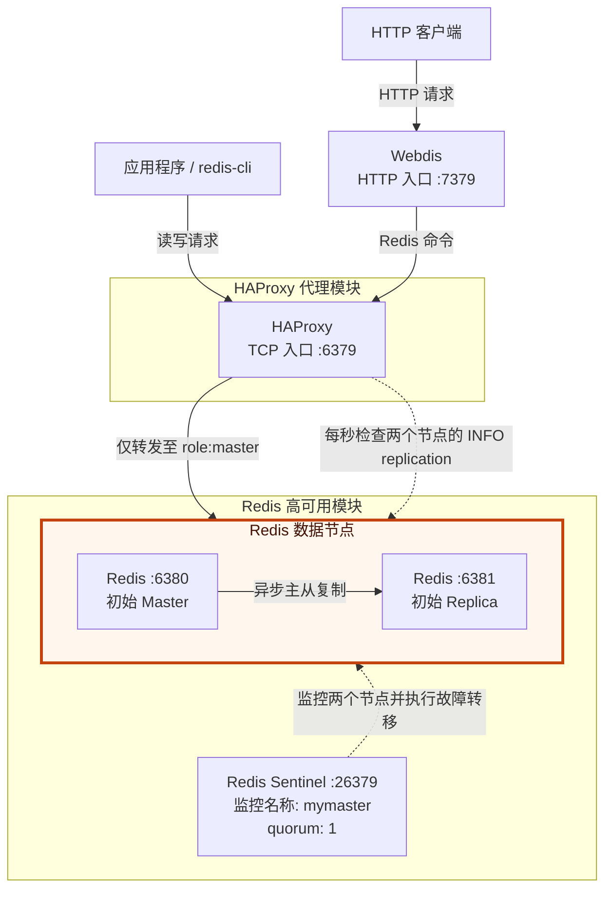

# Redis Sentinel + HAProxy + Webdis 高可用示例

本项目在单机上运行两个 Redis 实例、一个 Redis Sentinel、一个 HAProxy 和一个 Webdis，
用于演示 Redis 主从复制、自动故障转移，以及面向应用程序的固定 Master 和 HTTP 访问入口。

应用程序只需连接标准 Redis 地址 `127.0.0.1:6379`。HAProxy 会持续检查两个 Redis 节点的
复制角色，并仅将新连接转发给当前 Master。

## 架构图



初始状态下，`6380` 是 Master，`6381` 是 Replica。当 Sentinel 判定 Master
不可用时，它会将 Replica 提升为新 Master，并在旧 Master 恢复后将其配置为
Replica。HAProxy 根据 `INFO replication` 返回的 `role:master` 动态识别当前
Master，因此应用程序无须感知后端角色变化。

## 组件与端口

| 组件 | 地址 | 作用 |
| --- | --- | --- |
| Redis 节点 A | `127.0.0.1:6380` | 初始 Master |
| Redis 节点 B | `127.0.0.1:6381` | 初始 Replica |
| Redis Sentinel | `127.0.0.1:26379` | 监控 Redis，并执行故障转移 |
| HAProxy | `127.0.0.1:6379` | 应用程序访问当前 Master 的固定入口 |
| Webdis | `127.0.0.1:7379` | Redis HTTP API，后端连接 HAProxy |

所有服务仅监听本机地址。Redis 密码为 `zhuyanjun+123`，主从复制、Sentinel、HAProxy
健康检查和 Webdis 后端连接均已配置相同的认证信息。

HAProxy 的独立部署、配置和认证说明见 [`haproxy/README.md`](haproxy/README.md)。

## 工作原理

1. Redis `6381` 通过 `replicaof 127.0.0.1 6380` 复制初始 Master 的数据。
2. Sentinel 以 `mymaster` 为名称监控 `6380`，节点持续不可用 5 秒后触发判定，
   故障转移超时时间为 10 秒。
3. HAProxy 每秒向两个 Redis 节点执行 `INFO replication` 健康检查。
4. 只有响应中包含 `role:master` 的节点会被标记为可用并接收连接。
5. 后端 Master 下线时，HAProxy 会关闭相关会话；客户端应实现断线重连和命令重试。

## 环境要求

系统需要提供以下命令：

- `redis-server`
- `redis-cli`
- `haproxy`
- `webdis`
- Bash

在 Debian/Ubuntu 上可安装：

```bash
sudo apt update
sudo apt install redis-server redis-tools haproxy webdis
```

## 启动与停止

在项目根目录执行：

```bash
./start.sh
```

启动脚本会依次启动 Redis Master、Replica、Sentinel、HAProxy 和 Webdis。各脚本具有基本
的重复启动检测。

验证代理入口：

```bash
export REDISCLI_AUTH='zhuyanjun+123'
redis-cli -h 127.0.0.1 -p 6379 ping
redis-cli -h 127.0.0.1 -p 6379 role
curl http://127.0.0.1:7379/PING
```

停止所有组件：

```bash
./stop.sh
```

也可以在项目根目录单独控制各个进程：

| 进程 | 启动 | 停止 |
| --- | --- | --- |
| Redis 节点 6380 | `./start-redis-6380.sh` | `./stop-redis-6380.sh` |
| Redis 节点 6381 | `./start-redis-6381.sh` | `./stop-redis-6381.sh` |
| Redis Sentinel | `./start-sentinel.sh` | `./stop-sentinel.sh` |
| HAProxy | `./start-haproxy.sh` | `./stop-haproxy.sh` |
| Webdis | `./start-webdis.sh` | `./stop-webdis.sh` |

单节点脚本可重复执行：启动已运行的进程或停止未运行的进程都不会报错。由于故障转移
可能改变 Redis 的主从角色，脚本按端口命名，而不是按当前的 Master/Replica 角色命名。

查看所有进程的运行状态和 Redis 当前角色：

```bash
./status.sh
```

当所有服务均正常时，脚本退出码为 `0`；任一服务停止或降级时退出码为 `1`；缺少
`redis-cli`、`timeout` 或 `nc` 时退出码为 `2`。每次检查默认使用 1 秒连接超时和 2 秒命令
执行上限，防止服务无响应时脚本一直等待。可以通过 `STATUS_CONNECT_TIMEOUT` 和
`STATUS_COMMAND_TIMEOUT` 环境变量调整，单位均为秒。因此也可以在监控或其他自动化
脚本中调用它。

状态脚本还会通过 HAProxy Runtime API 显示 `redis-6380` 和 `redis-6381` 在 HAProxy
内部的健康状态、最近一次检查结果以及距离上次状态变化的秒数。该查询使用本地 Unix
Socket，不开放额外的网络端口，需要系统提供 `nc` 命令。修改 HAProxy 配置后需重启
HAProxy，Runtime API Socket 才会生效。

## 故障转移测试

通过 Sentinel 人工触发故障转移：

```bash
./force-failover.sh
```

脚本会显示切换前的 Master，提交 `SENTINEL FAILOVER mymaster` 请求，并等待 Sentinel
报告新的 Master。默认最多等待 30 秒，可使用 `FAILOVER_TIMEOUT` 调整：

```bash
FAILOVER_TIMEOUT=60 ./force-failover.sh
```

该命令会实际改变 Redis 主从角色并断开旧 Master 上经 HAProxy 建立的连接，请仅在确认
客户端具备断线重连和必要的命令重试能力后执行。

也可以通过停止当前 Master 模拟故障：

先通过代理写入测试数据：

```bash
export REDISCLI_AUTH='zhuyanjun+123'
redis-cli -h 127.0.0.1 -p 6379 set demo "hello"
```

停止初始 Master，模拟故障：

```bash
redis-cli -h 127.0.0.1 -p 6380 shutdown
```

等待 Sentinel 完成切换后，通过固定入口检查新 Master 和数据：

```bash
redis-cli -h 127.0.0.1 -p 6379 role
redis-cli -h 127.0.0.1 -p 6379 get demo
```

测试结束后可先执行 `./stop.sh`，再执行 `./start.sh` 恢复全部进程。Sentinel 和
Redis 可能已将故障转移后的角色写回配置文件，因此后续启动时的实际 Master
不一定仍是 `6380`；HAProxy 会继续按节点的实时角色进行路由。

## 项目结构

```text
.
├── start.sh                       # 启动全部组件
├── stop.sh                        # 停止全部组件
├── haproxy/
│   ├── README.md                  # HAProxy 独立部署与配置说明
│   ├── haproxy.cfg                # TCP 代理与 Master 健康检查
│   ├── start.sh
│   ├── stop.sh
│   ├── haproxy.pid                # 运行时生成
│   └── haproxy.sock               # 运行时生成
├── webdis/
│   ├── webdis.json                # HTTP 入口与 Redis 后端配置
│   ├── start.sh
│   ├── stop.sh
│   └── webdis.pid                 # 运行时生成
└── redis-servers/
    ├── start.sh                   # 启动两个 Redis 与 Sentinel
    ├── stop.sh
    ├── node-6380/                  # 配置、PID、日志与 data/
    ├── node-6381/                  # 配置、PID、日志与 data/
    └── sentinel/                   # 配置、PID、日志与 data/
```

Redis 持久化数据按固定节点保存在 `redis-servers/node-6380/data/` 和
`redis-servers/node-6381/data/`。目录名不表示当前的 Master/Replica 角色。

仓库内的 `redis.conf` 和 `sentinel.conf` 只作为初始配置模板。首次启动时，脚本会在对应
服务目录生成被 Git 忽略的 `.runtime.conf`，然后先进入该服务目录，再让 Redis 或 Sentinel
加载并改写运行时副本。副本会跨重启保留，以维持故障转移后的拓扑；如需重新应用模板，
请先停止所有服务，再删除三个 `.runtime.conf` 文件。

Redis 与 Sentinel 的 PID、日志和可变配置均与各自服务目录中的配置文件平级；日志路径为
`redis-servers/node-6380/redis.log`、`redis-servers/node-6381/redis.log` 和
`redis-servers/sentinel/sentinel.log`。其他服务的日志保存在
`haproxy/haproxy.log` 和 `webdis/webdis.log`。

## 配置说明

- Redis 同时启用 RDB 快照与 AOF 持久化。
- Webdis 监听 `127.0.0.1:7379`，并通过 HAProxy 的 `127.0.0.1:6379` 访问当前 Master。
- 启动脚本先进入各服务目录，因此配置和数据目录不依赖项目的绝对路径。

HAProxy 的配置参数、Redis 认证和独立启停方法见
[`haproxy/README.md`](haproxy/README.md)。

## 使用限制

该项目适合本地开发、学习和故障转移验证，不应直接作为生产部署方案：

- 所有组件位于同一台主机，无法抵御主机级故障。
- 只有一个 Sentinel，Sentinel 自身不存在高可用保障。生产环境通常应将至少三个
  Sentinel 分散部署在独立故障域，并设置合理的 quorum。
- Redis 已启用密码认证，但未启用 TLS，并仅监听 `127.0.0.1`。
- Redis 主从复制是异步的，故障切换时仍可能丢失尚未同步的数据。
